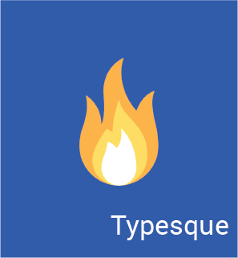

# Typesque Framework

This repo contains the core modules for the Typesque framework.

 

 

[![NPM Version][npm-image]][npm-url]
[![Build Status][travis-image]][travis-url]
[![Appveyor][appveyor-image]][appveyor-url]
[![Coveralls][coveralls-image]][coveralls-url]
[![FOSSA Status][fossa-image]][fossa-url]
[![Pr's Welcome][pr-welcoming-image]][pr-welcoming-url]

## Node/OS Target

This repo/branch is supposed to run fine on all major OS platforms and targets `Node.js >= 8.0.0`

## Cli Commands

You can either use `typesque` or `tsq` to access the cli

1. Create a new project `tsq new project-name`

2. Create a controller `tsq make:controller home-controller` or even shorter `tsq make:controller home`

3. Create a model `tsq make:model home`
4. Create a middleware `tsq make:middleware is-home`
